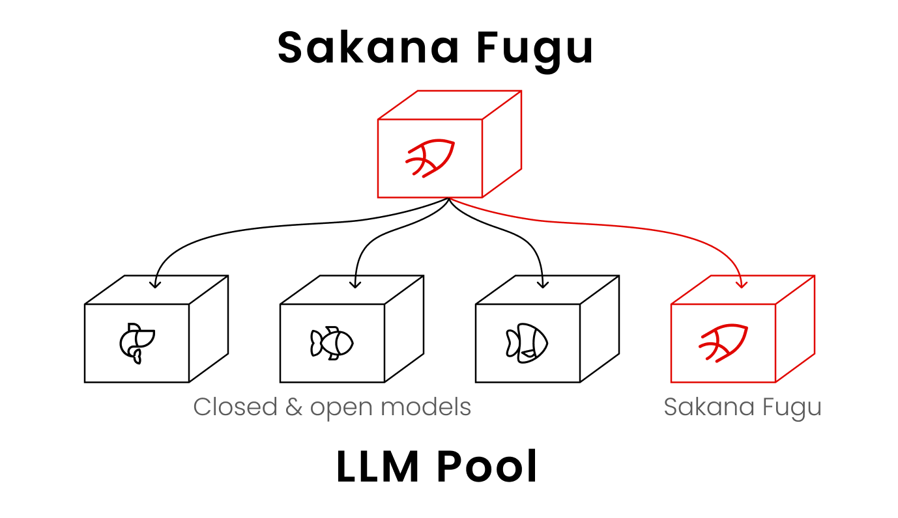
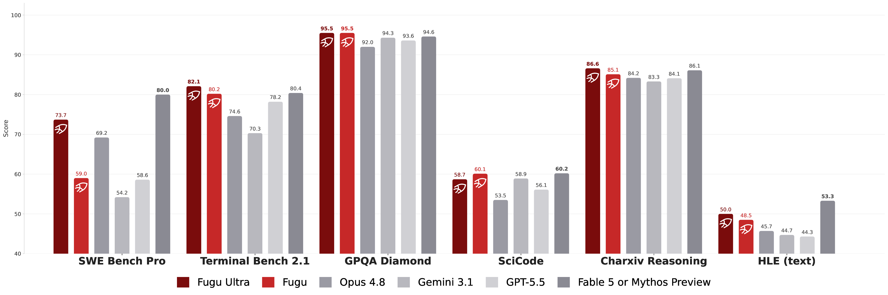
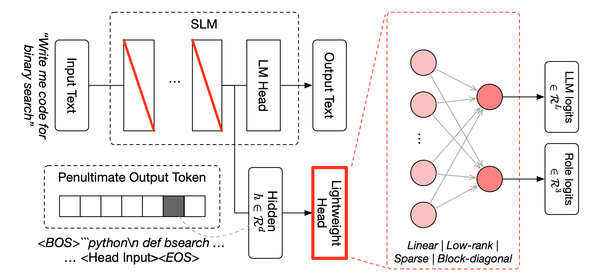
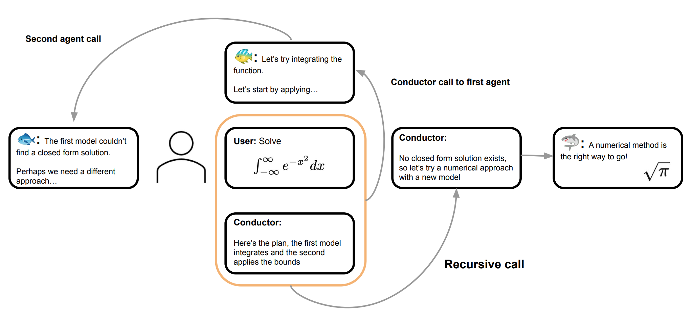

<p align="center">
  
</p>

# Sakana Fugu


[Sakana Fugu](https://sakana.ai/fugu/) is a multi-agent system delivered as one model. Fugu dynamically orchestrates frontier models to tackle complex, multi-step tasks. You can access the multi-agent system as a single LLM through the [Sakana API](https://console.sakana.ai/get-started), which supports both Chat Completions and Responses endpoints.

To quickly get started, you can install Fugu into Codex with a single command:
  
```bash
curl -fsSL https://sakana.ai/fugu/install | bash
```

Then launch it with:

```bash
codex-fugu
```

See the [command reference](docs/commands_details.md) for additional flags and options. The one-line install supports Ubuntu and macOS. On Windows, or if the install does not complete, follow the guide [here](https://console.sakana.ai/get-started#manually-setting-up-codex).

<br clear="all">

## Superior performance via intelligent coordination

Sakana Fugu achieves superior performance by dynamically coordinating and orchestrating a diverse pool of powerful models. For evaluation details, check [our technical report](https://arxiv.org/abs/2606.21228).

<p align="center">
  
</p>

These results reflect our June 2026 evaluation. As new frontier models are released, we continuously update our model pool and retrain our coordinators to maintain Fugu's performance advantage.

## Sakana Fugu in action

These examples compare Sakana Fugu models with three frontier baselines: Gemini 3.1 Pro (high), Opus 4.8 (max), and GPT 5.5 (xhigh). To keep the focus on behavior rather than brand-by-brand attribution, the baselines are anonymized as Model A, Model B, and Model C in each description. The mapping is intentionally not fixed across examples.

<table>
  <tr>
    <td width="50%"></td>
    <td width="50%"></td>
  </tr>
  <tr>
    <td></td>
    <td></td>
  </tr>
  <tr>
    <td></td>
    <td></td>
  </tr>
</table>

## Our research

Sakana Fugu is based on two papers published in ICLR 2026.

<table>
  <tr>
    <td width="50%" align="center" valign="top"><br><b><a href="https://arxiv.org/abs/2512.04695">TRINITY: An Evolved LLM Coordinator</a></b><br><br>A compact coordinator model, optimized with an evolutionary strategy, delegates three roles to a pool of LLMs turn by turn, letting them collaborate without weight merging or shared architectures.</td>
    <td width="50%" align="center" valign="top"><br><b><a href="https://arxiv.org/abs/2512.04388">Learning to Orchestrate Agents in Natural Language with the Conductor</a></b><br><br>A Conductor model, trained with reinforcement learning, designs agent-to-agent communication topologies and writes targeted instructions for each worker LLM, discovering coordination strategies that outperform any individual model.</td>
  </tr>
</table>

Since publication, we have made several enhancements. The full technical report is available [here](Fugu_technical_report.pdf).


## Support

Please contact us at https://fugu.sakana.ai for issues or bugs while using Sakana Fugu.


## Citation

If you use Sakana Fugu in your research, please cite our technical report:

```bibtex
@misc{fugu2026sakana,
      title={Sakana Fugu Technical Report},
      author={{Fugu Team, Sakana AI}},
      year={2026},
      eprint={2606.21228},
      archivePrefix={arXiv},
      primaryClass={cs.LG},
      url={https://arxiv.org/abs/2606.21228},
}
```


