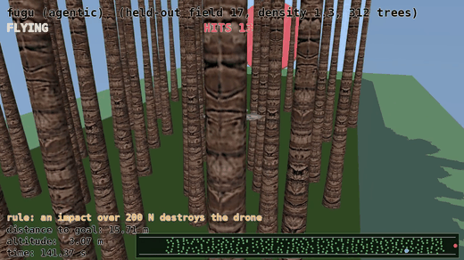
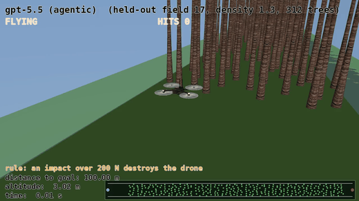
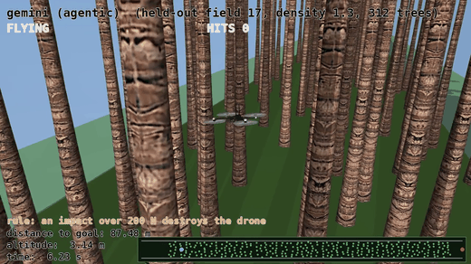

# Forest Drone: an agentic control benchmark



*Fugu-Ultra flying a forest it has never seen, with no map, just a forward depth fan, weaving to the
goal. It is the only one of the four models that gets through intact; the others wreck and drop to the
floor (2x speed).*

A quadrotor must cross a dense palm forest, start to goal, **without losing control**. It gets no map,
only a forward depth fan and its own motion, and it must **stay upright and navigate at once** (a
quadrotor is open-loop unstable: do nothing and it tips over). The task: write one controller,
`policy(obs) -> [4 rotor thrusts]`, that flies the whole run unchanged. No training, just the controller.

Every model gets the **same** task, the same start (a hover stub), and the same agentic loop: write a
controller, run it, read what failed, revise. The only variable is the model.

> **The result.** Only **Fugu-Ultra** flies the forest. It clears all 20 held-out forests intact,
> weaving between the trunks. Every baseline is destroyed on the trunks or loses control before the
> goal; the best of them clears just 3 of 20.

## The task

`task.md` is the whole spec: the observation (position, velocity, orientation, a forward depth fan,
goal bearing), the fixed 4-rotor mixing, and the rules. The model sees only that. No simulator
internals, no tree positions, no map.

## Reproduce it

Local MuJoCo (`mujoco` env), CPU only, no API calls to grade or render.

**1. Write a controller.** Paste this one prompt into
[codex-fugu](https://console.sakana.ai/get-started#using-sakana-fugu-in-codex) (same for every model;
for a baseline, point Codex at another model or use OpenRouter):

```
Read task.md, then write and iterate policy.py using run_dev.py as your feedback signal.
Reach every practice seed cleanly, then push the score as high as you can.
```

`run_dev.py` flies your `policy.py` on three practice forests and prints the score. (`policy.py` starts
as a hover stub.)

**2. Grade it** on the 20 frozen held-out forests:

```bash
# the four controllers shipped here -> the leaderboard below
conda run --no-capture-output -n mujoco python grade_survival.py
# or your own controller
conda run --no-capture-output -n mujoco python grade_survival.py --policy policy.py --label mymodel
```

**3. Watch any field.** The survivability rule is on by default, so the drone drops the moment it takes
a lethal hit:

```bash
MUJOCO_GL=egl conda run --no-capture-output -n mujoco python render.py --id 7 --arm opus
```

`--arm`: `fugu_ultra` / `opus` / `gpt` / `gemini`; `--id`: any field 0 to 19; the clip lands in
`videos/`. `MUJOCO_GL=egl` is needed to render on a headless machine. Every model is graded on the same
frozen `benchmark/fields.json`.

## How it's graded

One rule: **reach the goal without wrecking.** A tree impact over **200 N** destroys the drone and ends
the run (200 N is about 20 kgf; it is the summed normal force of the drone's tree contacts in that
step, from MuJoCo's `mj_contactForce`). Among drones that arrive intact, a faster, cleaner line scores
higher.

No model is told this. `task.md` only asks it to reach quickly, so flying gently enough to survive is
something the controller had to discover on its own. Fugu-Ultra is the one that did.

## Results

The 20 frozen held-out forests (`benchmark/fields.json`: 100 m corridor, 283 to 314 trees, densities
1.15x to 1.3x). Per-field numbers are in each arm's `artifacts/metrics.json`.

| Model (agentic) | Reaches goal intact | Mean score | Hardest impact |
|---|---|---|---|
| **Fugu-Ultra** | **20 / 20** | **97.0** | **153 N** |
| GPT-5.5 | 3 / 20 | 26.0 | 441 N |
| Gemini 3.1 Pro | 1 / 20 | 19.8 | 483 N |
| Opus 4.8 | 0 / 20 | 7.2 | 321 N |

Models are ranked by forests crossed intact. The impact column is context, not a rank: it is the
hardest hit each drone took while still flying (for a wrecked one, the blow that killed it). So Opus's
321 N sits below GPT-5.5's 441 N only because Opus is killed by a just-over-threshold hit in every
field, while GPT-5.5 hits harder but survives a few. Fugu-Ultra's 153 N stays under the 200 N line the
whole way; the rest cross it.

### Fugu-Ultra (flies the forest)

All 20 intact, mean 97.0, a clean sweep no other model nears. It picks the widest visible gap, points
along its actual travel direction, and slows only where clearance is tight, so it threads the trunks
(the header clip). Its hardest hit anywhere is 153 N, under the 200 N line, so a real drone flying this
controller would come out the other side intact. Controller: `fugu_ultra/scripts/policy.py`.

### GPT-5.5 (mostly loses control)



3 of 20 intact (mean 26.0). Usually tips over or hits the ground before the goal; when it stays up, it
still slams the trunks hard enough to be destroyed.

### Gemini 3.1 Pro (rarely gets through)



1 of 20 intact (mean 19.8). Loses control or stalls out early on almost every field.

### Opus 4.8 (bulldozes, and wrecks)


It drives into the trunks instead of weaving. Every run takes a hit past 200 N, so the drone is
destroyed every time: 0 / 20. It never flies a forest.

## Keeping it honest

A shell-enabled agent will grab any shortcut. In an early run one just copied a reference controller
(`cp .../policy.py policy.py`) to claim its score. So each baseline ran isolated:

- **Structural (primary).** Each ran in its own copy of this folder holding only the simulator, the
  practice forests, the spec, and its `policy.py`: no held-out fields, no reference controller, no
  recipe, and no view of the other arms. The agent was confined to its box
  (`--cd <box> -s workspace-write`).
- **Audit (backing).** Each final `policy.py` was checked to be a self-contained reactive controller
  (no simulator import, no file reads, no map or route) and not a copy of any reference.

Fugu-Ultra needed no box. It ran first, before any reference existed, and passes the same audit. Every
controller is graded on forests it never saw during iteration, so the numbers are out-of-sample.

## What's in here

| Path | What it is |
|---|---|
| `task.md` | The complete task the model is given |
| `env.py`, `field.py`, `benchmark.py` | The MuJoCo simulator and forest generator |
| `benchmark/fields.json` | The 20 frozen held-out forests (geometry only; no solution route) |
| `run_dev.py` | Practice-forest feedback loop the agent iterates against |
| `grade_survival.py` | Grades a controller on the survivability rule |
| `render.py` | Renders a clip of one field |
| `build_benchmark.py` | Regenerates the frozen benchmark from scratch |
| `<model>/scripts/policy.py` | Each model's final controller |
| `<model>/artifacts/metrics.json` | Its per-field numbers |

## Assets and credits

- Airframe: `skydio_x2` from [MuJoCo Menagerie](https://github.com/google-deepmind/mujoco_menagerie)
  (Apache-2.0; license under `assets/skydio_x2/`).
- Palm mesh under `assets/palm_tree_v2/` by **Nobiax**, free for any use (see
  `assets/palm_tree_v2/readme.txt`).
- Simulation: [MuJoCo](https://mujoco.org/).

_Showcase clips play at 2x._
